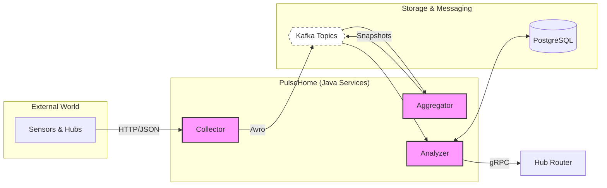

# PulseHome

[Read this in Russian](./README.ru.md)

PulseHome is an open-source Smart Home telemetry platform built as a set of Java services around Kafka, Avro, Spring Boot, and gRPC.

The project models a realistic telemetry pipeline for connected-home systems:

- devices and hubs publish events into the platform;
- the platform aggregates raw sensor streams into hub-level snapshots;
- the analyzer evaluates user-defined automation scenarios and sends device actions back through a hub router.

This repository is meant to be useful both as a learning project and as a production-style reference for event-driven backend design in Java.

## Why this project exists

PulseHome was built to explore the core backend problems behind Smart Home automation:

- ingesting heterogeneous device and hub events;
- keeping an up-to-date view of home state;
- evaluating user scenarios safely and repeatably;
- handling retries, deduplication, and graceful shutdown in long-running Kafka workers;
- keeping service boundaries clean between transport formats, persistence, and domain logic.

## Architecture



## Implemented modules

The root project is a multi-module Maven build.

### `telemetry`

This is the main implemented area of the repository.

- `telemetry/collector`
  Receives incoming events and publishes them to Kafka.
- `telemetry/aggregator`
  Consumes raw sensor events, maintains the latest hub snapshot, and publishes updated snapshots.
- `telemetry/analyzer`
  Stores hub configuration and scenarios, analyzes incoming snapshots, and dispatches device actions through gRPC.
- `telemetry/serialization`
  Contains shared Avro schemas, generated contracts, and protobuf/gRPC contracts.

### `infra` and `commerce`

These modules are present in the build as future extension points, but the current working implementation is focused on the telemetry pipeline.

## Service responsibilities

### Collector

Collector is a Spring Boot web application that accepts incoming event payloads and pushes them into Kafka.

Current endpoints:

- `POST /events/sensors`
- `POST /events/hubs`

Kafka topics:

- `telemetry.sensors.v1`
- `telemetry.hubs.v1`

### Aggregator

Aggregator is a non-web Spring Boot worker.

It:

- consumes `telemetry.sensors.v1`;
- keeps the latest sensor state per hub;
- emits updated snapshots to `telemetry.snapshots.v1`;
- avoids unnecessary snapshot writes when state has not changed.

### Analyzer

Analyzer is a non-web Spring Boot worker with two independent Kafka processing loops.

It:

- consumes hub configuration events from `telemetry.hubs.v1`;
- consumes hub snapshots from `telemetry.snapshots.v1`;
- persists sensors, scenarios, conditions, and actions in PostgreSQL;
- evaluates scenarios against the latest hub snapshot;
- dispatches device actions through the Hub Router gRPC client;
- tracks dispatched actions to avoid unsafe replays on retryable failures.

## Technology stack

- Java 25
- Maven
- Spring Boot 3.5
- Apache Kafka
- Apache Avro
- gRPC / Protobuf
- PostgreSQL
- Flyway
- H2 for tests

## Prerequisites

Before running the services locally, make sure you have:

- JDK 25
- Maven 3.9+
- Kafka running locally or reachable from the configured bootstrap servers
- PostgreSQL for the Analyzer runtime database
- a Hub Router gRPC endpoint if you want to exercise real Analyzer action dispatch

## Configuration

The services are configured through Spring Boot `application.yml` files and environment variables.

Most important defaults:

- Kafka bootstrap servers: `localhost:9092`
- Analyzer PostgreSQL URL: `jdbc:postgresql://localhost:5432/analyzer`
- Analyzer Hub Router gRPC address: `localhost:59090`

Useful environment variables:

```bash
KAFKA_BOOTSTRAP_SERVERS=localhost:9092
ANALYZER_DATASOURCE_URL=jdbc:postgresql://localhost:5432/analyzer
ANALYZER_DATASOURCE_USERNAME=postgres
ANALYZER_DATASOURCE_PASSWORD=postgres
```

## Build and test

Run the full test suite:

```bash
mvn test
```

Run tests for a single module:

```bash
mvn -pl telemetry/collector test
mvn -pl telemetry/aggregator test
mvn -pl telemetry/analyzer test
```

Build the full project:

```bash
mvn clean verify
```

## Running the services locally

Start the services in this order:

1. Kafka
2. PostgreSQL
3. Collector
4. Aggregator
5. Analyzer

Run each service from the repository root:

```bash
mvn -pl telemetry/collector spring-boot:run
mvn -pl telemetry/aggregator spring-boot:run
mvn -pl telemetry/analyzer spring-boot:run
```

## Development notes

- Collector currently exposes HTTP endpoints for ingestion.
- Aggregator and Analyzer are non-web worker processes.
- Analyzer uses PostgreSQL at runtime and H2 in tests.
- Shared wire contracts live in the serialization modules so that services can evolve around a common event model.

## Quality goals

This repository intentionally aims higher than a minimal coursework solution.

Key design goals include:

- clear service boundaries;
- explicit schema contracts;
- safe Kafka offset management;
- retry-aware processing;
- idempotent action dispatch tracking;
- production-style configuration and validation;
- maintainable, testable code over ad-hoc shortcuts.

## Roadmap ideas

Possible future improvements include:

- containerized local infrastructure for one-command startup;
- end-to-end integration tests with Kafka and PostgreSQL;
- observability dashboards and metrics;
- a reference Hub Router implementation;
- richer scenario types and device capabilities.

## License

This project is licensed under the [MIT License](./LICENSE).
