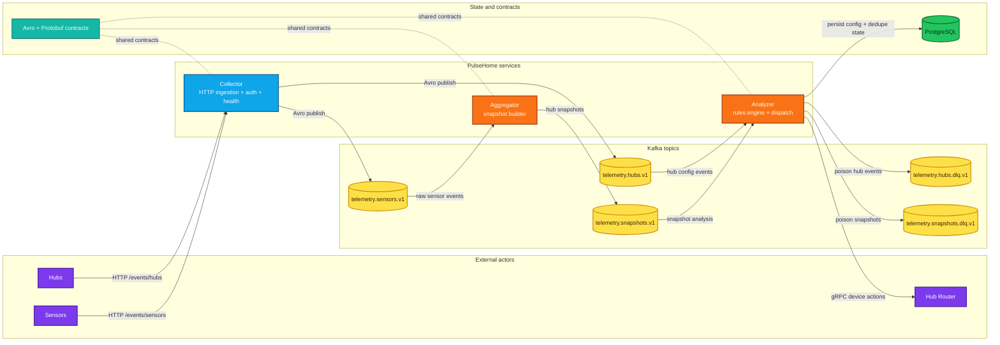

# PulseHome

[Read this in Russian](./README.ru.md)

PulseHome is an open-source Smart Home telemetry platform built as a production-style Java 25 event pipeline. It receives device and hub events over HTTP, streams them through Kafka using Avro contracts, builds hub-level snapshots, evaluates automation scenarios, and dispatches device actions over gRPC.

The repository is designed as a professional reference implementation for resilient backend design around Spring Boot, Kafka, Avro, PostgreSQL, Flyway, and gRPC.

## What PulseHome does

- ingests raw sensor and hub events;
- keeps the latest state of every hub in snapshot form;
- persists hub configuration and automation scenarios;
- evaluates scenarios against incoming snapshots;
- sends device commands back through a hub router;
- stays aligned with a Java 25 runtime baseline for both local development and Docker deployment.

## Architecture at a glance



## Processing flow

1. Devices and hubs send JSON payloads to the Collector.
2. Collector validates, serializes, and publishes events into Kafka.
3. Aggregator consumes sensor events and builds the latest hub snapshot.
4. Analyzer consumes snapshots and hub configuration events, keeps durable state in PostgreSQL, evaluates scenarios, and dispatches actions through the Hub Router.
5. Poison messages are isolated into dedicated DLQ topics instead of stopping the whole pipeline.

## Repository structure

| Module | Purpose |
| --- | --- |
| `telemetry/collector` | Spring Boot web service for HTTP ingestion, security, async Kafka publishing, and actuator health |
| `telemetry/aggregator` | Spring Boot worker that rebuilds current hub state and publishes snapshots |
| `telemetry/analyzer` | Spring Boot worker that stores hub config, evaluates scenarios, and dispatches actions |
| `telemetry/serialization/avro-schemas` | Shared Avro contracts, serializer/deserializer helpers, generated classes |
| `telemetry/serialization/proto-schemas` | Shared protobuf and gRPC contracts |
| `infra/hub-router-stub` | Local gRPC stub for end-to-end smoke testing |

## Service responsibilities

### Collector

- exposes `POST /events/sensors`
- exposes `POST /events/hubs`
- protects ingestion endpoints with Basic Auth
- publishes to `telemetry.sensors.v1` and `telemetry.hubs.v1`
- exposes `GET /actuator/health`

### Aggregator

- consumes `telemetry.sensors.v1`
- restores the last known snapshot state before replay
- keeps hub snapshots in memory with guarded lifecycle/shutdown logic
- publishes updated snapshots to `telemetry.snapshots.v1`

### Analyzer

- consumes `telemetry.hubs.v1`
- consumes `telemetry.snapshots.v1`
- persists sensors, scenarios, conditions, actions, and dispatch history in PostgreSQL
- retries transient action dispatch failures
- sends poisoned hub and snapshot messages to DLQ topics
- dispatches actions through the Hub Router gRPC client

## Event contracts and topic map

| Topic | Producer | Consumer | Payload |
| --- | --- | --- | --- |
| `telemetry.sensors.v1` | Collector | Aggregator | `SensorEventAvro` |
| `telemetry.hubs.v1` | Collector | Analyzer | `HubEventAvro` |
| `telemetry.snapshots.v1` | Aggregator | Analyzer | `SensorsSnapshotAvro` |
| `telemetry.hubs.dlq.v1` | Analyzer | Ops / debugging | JSON dead-letter envelope |
| `telemetry.snapshots.dlq.v1` | Analyzer | Ops / debugging | JSON dead-letter envelope |

## Contract and validation policy

- Avro unions intentionally do not include a `null` branch for event payloads and snapshot sensor data.
  This is a deliberate contract strategy: unsupported payload types must fail fast instead of degrading silently.
- New Avro payloads are appended to existing unions and released together with reader support.
- Sensor DTO validation currently enforces structural correctness, required fields, and string sizes.
- Product-specific physical bounds for values such as temperature, luminosity, link quality, voltage, or CO2 should be added only after the supported device fleet and calibration ranges are formally approved.
- The implementation points for those future bounds are the Collector DTO validation layer and the shared Avro schema docs in `telemetry/collector/src/main/java/.../dto/sensor` and `telemetry/serialization/avro-schemas/src/main/avro`.

## Database migration policy

- Flyway versioned migrations are treated as immutable production history.
- If a historical migration later becomes redundant for fresh installs, it is still preserved as part of the upgrade path for already deployed environments.
- Redundant or defensive migrations are cleaned up only during an explicit baseline reset or a future major migration consolidation, never by editing an applied versioned file in place.
- This is why historical steps such as the existing `V8` index migration remain in the chain: the project prefers auditability and checksum stability over rewriting database history.

## Technology stack

- Java 25
- Maven 3.9+
- Spring Boot 3.5
- Apache Kafka
- Apache Avro
- gRPC / Protobuf
- PostgreSQL
- Flyway
- Bouncy Castle (PQC)
- H2 for tests
- Docker Compose for local production-like runs

## Post-Quantum Cryptography

PulseHome implements hybrid post-quantum protection at the Kafka transport layer, guarding all telemetry traffic against "Store Now, Decrypt Later" (SNDL) attacks.

### Why it matters

Quantum computers capable of breaking RSA and ECC are projected by 2029-2035. Smart home devices have a lifespan of 10-20 years, meaning data captured today may be decrypted retroactively. PulseHome addresses this threat proactively.

### What is protected

```
Collector  ──TLS 1.3 + X25519MLKEM768──>  Kafka
Aggregator ──TLS 1.3 + X25519MLKEM768──>  Kafka
Analyzer   ──TLS 1.3 + X25519MLKEM768──>  Kafka
```

Every Kafka producer and consumer uses a custom `HybridPqcSslEngineFactory` that configures the TLS 1.3 handshake to prioritize the hybrid key exchange group **X25519MLKEM768**.

### Algorithm stack

| Layer | Algorithm | Standard | Purpose |
| --- | --- | --- | --- |
| Key exchange | **X25519MLKEM768** | NIST FIPS 203 + RFC 7748 | Hybrid: classical ECDH (X25519) combined with post-quantum ML-KEM-768 |
| Symmetric cipher | AES-256-GCM / AES-128-GCM / CHACHA20-POLY1305 | NIST FIPS 197 | Negotiated by TLS 1.3 with the broker |
| TLS protocol | TLS 1.3 | RFC 8446 | Transport security with forward secrecy |
| JCA provider | Bouncy Castle + BCJSSE | BC 1.81 | PQC-capable JSSE provider for named group negotiation |

### How it works

1. **BCJSSE provider** is registered at application startup in every service.
2. The custom `HybridPqcSslEngineFactory` builds an `SSLContext` from Kafka keystore/truststore config and sets `X25519MLKEM768` as the preferred named group.
3. During the TLS 1.3 handshake, the client proposes both a classical X25519 key share and an ML-KEM-768 encapsulation. The shared secret is derived from **both** algorithms.
4. If the BCJSSE provider is not on the classpath or X25519MLKEM768 is not supported, the factory **refuses to start** (`IllegalStateException`). There is no silent downgrade.

### Enforced protection

PQC is **mandatory** when `KAFKA_SSL_PQC_REQUIRE=true` (`ssl.pqc.require` defaults to `true` in service configuration):

- If `BCJSSE` provider is missing → startup **fails** with a clear error.
- If `X25519MLKEM768` is not supported by the provider → startup **fails**.
- The factory **does not silently fall back** to classical ECDH.
- To run without PQC (dev/test only), explicitly set `KAFKA_SSL_PQC_REQUIRE=false`.

Docker Compose sets `KAFKA_SSL_PQC_REQUIRE=false` by default so the local smoke stack can run on JDK/provider combinations where BCJSSE does not expose `X25519MLKEM768`.
For a real production deployment, switch it back to `true` only after verifying that the chosen JDK and Bouncy Castle runtime support that named group.

> **Principle:** a quantum-unsafe connection is worse than no connection at all.
> PulseHome prefers to crash-and-alert rather than silently degrade.

### NIST standards coverage

| Standard | Algorithm | Status | Usage in PulseHome |
| --- | --- | --- | --- |
| FIPS 203 | ML-KEM (CRYSTALS-Kyber) | Finalized Aug 2024 | Key exchange via X25519MLKEM768 |
| FIPS 204 | ML-DSA (CRYSTALS-Dilithium) | Finalized Aug 2024 | Available via Bouncy Castle for future certificate signing |
| FIPS 205 | SLH-DSA (SPHINCS+) | Finalized Aug 2024 | Available as conservative backup |

### TLS certificates and production key setup

Docker Compose generates self-signed certificates automatically via the `tls-init` service.
For production, replace them with certificates issued by your organization's CA.

**1. Automatic (Docker Compose dev/staging):**

```bash
cp .env.example .env
# Set a strong password:
#   TLS_STORE_PASSWORD=your-strong-password-here
docker compose up --build -d
```

The `tls-init` service runs `infra/tls/generate-certs.sh` and produces:
- `ca.p12` — self-signed CA keystore
- `kafka.keystore.p12` — broker keystore (signed by CA)
- `client.keystore.p12` — shared client keystore (signed by CA)
- `truststore.p12` — truststore with the CA certificate

All services mount the shared volume `pulsehome-tls-certs` and use the same `TLS_STORE_PASSWORD`.

**2. Production (bring your own certificates):**

```bash
# Required environment variables for each service:
KAFKA_SECURITY_PROTOCOL=SSL
KAFKA_SSL_TRUSTSTORE_LOCATION=/path/to/truststore.p12
KAFKA_SSL_TRUSTSTORE_PASSWORD=<truststore-password>
KAFKA_SSL_KEYSTORE_LOCATION=/path/to/client.keystore.p12
KAFKA_SSL_KEYSTORE_PASSWORD=<keystore-password>
KAFKA_SSL_KEY_PASSWORD=<private-key-password>

# PQC enforcement (default: true, do NOT disable in production)
KAFKA_SSL_PQC_REQUIRE=true
```

**3. Where to put secrets:**

| Secret | Where | Format |
| --- | --- | --- |
| `TLS_STORE_PASSWORD` | `.env` file (Docker) or vault | Single shared password for all auto-generated stores |
| `KAFKA_SSL_*_PASSWORD` | Environment variable or K8s Secret | Per-store passwords when using custom certs |
| `COLLECTOR_BASIC_AUTH_PASSWORD` | `.env` file or vault | HTTP Basic Auth for Collector API |
| `PULSEHOME_POSTGRES_PASSWORD` | `.env` file or vault | PostgreSQL password for Analyzer |

> **Security rules:**
> - Never commit `.env` or keystore files to Git (`.gitignore` already excludes them).
> - Use a secrets manager (HashiCorp Vault, AWS Secrets Manager, K8s Secrets) in production.
> - Rotate TLS certificates before expiry (`CERT_VALIDITY` defaults to 825 days).
> - Use unique passwords per keystore in production — the shared `TLS_STORE_PASSWORD` is for local dev only.

## Java 25 baseline

PulseHome is intentionally aligned to Java 25.

What is already tuned for it:

- Docker runtime uses Java 25 and enables the native-access flags needed by modern gRPC/Netty stacks.
- Local Maven runs use [.mvn/jvm.config](./.mvn/jvm.config) to suppress Java 25 `sun.misc.Unsafe` noise coming from Maven internals.
- Surefire disables CDS sharing for test JVMs to avoid noisy Java 25 bootstrap warnings.
- Docker and local Maven builds are kept warning-clean for the current toolchain baseline.

## Quick start with Docker

This is the fastest way to run the whole stack locally.

```bash
cp .env.example .env
# edit .env with your local secrets
docker compose up --build -d
```

What starts:

- Kafka
- PostgreSQL
- Collector
- Aggregator
- Analyzer
- Hub Router Stub

Quick checks:

```bash
curl http://localhost:8080/actuator/health
docker compose ps
docker compose logs -f collector
```

`docker compose` reads secrets from environment variables or a local `.env` file.
Tracked files only ship the [.env.example](./.env.example) template.

To stop the stack:

```bash
docker compose down
```

## Deploy on a server and connect your own app

This section is written as "which value goes into which file". Line numbers may move, so search for the exact variable or line shown below.

### 1. Clone the project and create `.env`

Run this on the server:

```bash
git clone <your-fork-or-this-repo-url> pulsehome
cd pulsehome
cp .env.example .env
chmod 600 .env
```

Open `.env` in the PulseHome repository root. Unless a step says otherwise, all values below are changed in this file.

### 2. Replace values in `.env`

Database. Open `.env` and replace the value after `=`:

| Find this line in `.env` | Replace it with |
| --- | --- |
| `PULSEHOME_POSTGRES_DB=pulsehome` | Database name for this server, for example `pulsehome_prod`. |
| `PULSEHOME_POSTGRES_USER=pulsehome_app` | Database username, for example `pulsehome_app`. |
| `PULSEHOME_POSTGRES_PASSWORD=replace-with-strong-db-password` | Strong database password generated by you. |
| `PULSEHOME_POSTGRES_BIND_ADDRESS=127.0.0.1` | Usually keep `127.0.0.1` so PostgreSQL is not public. |
| `PULSEHOME_POSTGRES_HOST_PORT=15432` | Usually keep `15432`; change only if the port is busy. |

Do not put these values into Java code. `compose.yml` passes them to the `postgres` and `analyzer` containers.

Collector API. Your backend or trusted gateway uses these credentials to send events to PulseHome:

| Find this line in `.env` | Replace it with |
| --- | --- |
| `COLLECTOR_BASIC_AUTH_USERNAME=pulsehome_ingest` | A service username, for example `pulsehome_ingest`. Put the same value into your backend as `PULSEHOME_API_USERNAME`. |
| `COLLECTOR_BASIC_AUTH_PASSWORD=replace-with-strong-collector-api-password` | Strong API password. Put the same value into your backend as `PULSEHOME_API_PASSWORD`. Do not put it into frontend code. |
| `COLLECTOR_BIND_ADDRESS=127.0.0.1` | Keep `127.0.0.1` if Caddy/Nginx runs on the same server. |
| `COLLECTOR_HOST_PORT=8080` | Collector port on the server. If you change it, use the same port in reverse proxy: `127.0.0.1:<your-port>`. |
| `COLLECTOR_REQUIRE_HTTPS=false` | Keep `false` for the first run. After HTTPS works, change to `true`. |

Kafka TLS. This protects internal traffic between PulseHome services:

| Find this line in `.env` | Replace it with |
| --- | --- |
| `TLS_STORE_PASSWORD=replace-with-strong-tls-store-password` | Strong TLS store password. Set it before the first `docker compose up`. |
| `KAFKA_SSL_PQC_REQUIRE=false` | Keep `false` for the first run; after checking `X25519MLKEM768` support, you may change it to `true`. |
| `KAFKA_HOST_BIND_ADDRESS=127.0.0.1` | Keep `127.0.0.1`; Kafka should not be public. |
| `KAFKA_HOST_PORT=19092` | Usually keep `19092`; this is the local Kafka admin/client port on the server. |

Hub Router. Keep the stub for demo. For real hardware, replace two lines:

| Find this line in `.env` | Demo value | Real Hub Router value |
| --- | --- | --- |
| `GRPC_HUB_ROUTER_ADDRESS=static://hub-router-stub:59090` | Keep it. | `GRPC_HUB_ROUTER_ADDRESS=static://hub-router.your-domain.com:443` |
| `GRPC_HUB_ROUTER_NEGOTIATION_TYPE=plaintext` | Keep it. | `GRPC_HUB_ROUTER_NEGOTIATION_TYPE=TLS` |

### 3. Put the domain into DNS and reverse proxy

In your domain DNS panel, create this record:

| DNS field | Value |
| --- | --- |
| Type | `A` |
| Name/Host | `api` if you want `api.your-domain.com` |
| Value/IP | Your server public IP |

If you use Caddy, open `/etc/caddy/Caddyfile` and replace:

| Find in Caddy file | Replace with |
| --- | --- |
| `api.your-domain.com` | Your API domain, for example `api.example.com`. |
| `127.0.0.1:8080` | Keep it if `.env` has `COLLECTOR_HOST_PORT=8080`; otherwise use `127.0.0.1:<your-COLLECTOR_HOST_PORT>`. |

Example:

```caddyfile
api.example.com {
    reverse_proxy 127.0.0.1:8080 {
        header_up X-Forwarded-Proto https
        header_up X-Forwarded-Host {host}
    }
}
```

Reload Caddy:

```bash
sudo systemctl reload caddy
```

If you use Nginx, open `/etc/nginx/sites-available/pulsehome.conf` and replace:

| Find in Nginx file | Replace with |
| --- | --- |
| `server_name api.your-domain.com;` | `server_name api.example.com;` with your domain. |
| `/etc/letsencrypt/live/api.your-domain.com/fullchain.pem` | Certificate path for your API domain. |
| `/etc/letsencrypt/live/api.your-domain.com/privkey.pem` | Private key path for your API domain. |
| `proxy_pass http://127.0.0.1:8080;` | Keep it if `COLLECTOR_HOST_PORT=8080`; otherwise use your port. |

Example:

```nginx
server {
    listen 443 ssl http2;
    server_name api.example.com;

    ssl_certificate /etc/letsencrypt/live/api.example.com/fullchain.pem;
    ssl_certificate_key /etc/letsencrypt/live/api.example.com/privkey.pem;

    location / {
        proxy_pass http://127.0.0.1:8080;
        proxy_set_header Host $host;
        proxy_set_header X-Forwarded-Proto https;
        proxy_set_header X-Forwarded-For $proxy_add_x_forwarded_for;
    }
}
```

Test and reload Nginx:

```bash
sudo nginx -t
sudo systemctl reload nginx
```

### 4. Put PulseHome settings into your backend app

This is not a PulseHome file. It is your backend config on your hosting.

If your backend has a `.env`, add:

```dotenv
PULSEHOME_API_BASE_URL=https://api.example.com
PULSEHOME_API_USERNAME=pulsehome_ingest
PULSEHOME_API_PASSWORD=<same-value-as-COLLECTOR_BASIC_AUTH_PASSWORD-in-PulseHome-.env>
```

If your backend is on a hosting platform with an environment panel, add the same three variables there:

| Hosting variable | Value |
| --- | --- |
| `PULSEHOME_API_BASE_URL` | Your PulseHome API domain, for example `https://api.example.com`. |
| `PULSEHOME_API_USERNAME` | Same as `COLLECTOR_BASIC_AUTH_USERNAME` in PulseHome `.env`. |
| `PULSEHOME_API_PASSWORD` | Same as `COLLECTOR_BASIC_AUTH_PASSWORD` in PulseHome `.env`. |

If your backend also runs through Docker Compose, add this to your backend service:

```yaml
environment:
  PULSEHOME_API_BASE_URL: https://api.example.com
  PULSEHOME_API_USERNAME: pulsehome_ingest
  PULSEHOME_API_PASSWORD: <same-value-as-COLLECTOR_BASIC_AUTH_PASSWORD>
```

The frontend/site must not store the PulseHome password. Put only your own backend URL into the frontend, for example in your site `.env.production`:

```dotenv
PUBLIC_APP_BACKEND_URL=https://app-backend.example.com
```

Correct flow:

```text
Website or mobile app -> your backend -> PulseHome Collector
Trusted IoT gateway   -> PulseHome Collector
```

### 5. Start and verify

From the PulseHome repository root on the server:

```bash
docker compose config --quiet
docker compose up --build -d
docker compose ps
```

Check from the server:

```bash
curl http://127.0.0.1:8080/actuator/health
```

Check through the domain:

```bash
curl https://api.example.com/actuator/health
```

After the HTTPS domain works, return to PulseHome `.env` and replace:

```dotenv
COLLECTOR_REQUIRE_HTTPS=true
```

Then recreate Collector:

```bash
docker compose up -d collector
```

### 6. First test request from backend/gateway

Use the same backend env values added above:

```bash
curl -u "$PULSEHOME_API_USERNAME:$PULSEHOME_API_PASSWORD" \
  -H "Content-Type: application/json" \
  -d '{
    "type": "SWITCH_SENSOR_EVENT",
    "id": "switch-1",
    "hubId": "home-1",
    "timestamp": "2026-05-01T12:00:00Z",
    "state": true
  }' \
  "$PULSEHOME_API_BASE_URL/events/sensors"
```

Change these JSON values for your app:

| JSON field | Value |
| --- | --- |
| `hubId` | Home/account/gateway ID in your app, for example `home-1`. |
| `id` | Device ID in your app, for example `switch-1`. |
| `timestamp` | UTC event time. You may omit it; Collector fills current time for supported DTOs. |
| `state` | Sensor state, for example `true` or `false`. |

### 7. What not to expose publicly

| Service/port | What to do |
| --- | --- |
| PostgreSQL `15432` | Keep on `127.0.0.1`, do not expose publicly. |
| Kafka `19092` | Keep on `127.0.0.1`, do not expose publicly. |
| Hub Router Stub `59090` | Local smoke-test only, do not expose publicly. |
| Collector `8080` | Expose through HTTPS reverse proxy, not directly. |

Do not commit `.env`. Commit `.env.example` only.

## Local development without Docker

Prerequisites:

- JDK 25
- Maven 3.9+
- Kafka reachable by configured bootstrap servers
- PostgreSQL for Analyzer runtime
- a Hub Router gRPC endpoint, or the local stub from `infra/hub-router-stub`

Recommended startup order:

1. Kafka
2. PostgreSQL
3. Hub Router Stub
4. Collector
5. Aggregator
6. Analyzer

Run services from the repository root:

```bash
mvn -pl infra/hub-router-stub spring-boot:run
mvn -pl telemetry/collector spring-boot:run
mvn -pl telemetry/aggregator spring-boot:run
mvn -pl telemetry/analyzer spring-boot:run
```

## Configuration

The services use Spring profiles and environment variables. `dev` is aimed at local work, and `prod` is used by Docker Compose.

Most important variables:

```bash
SPRING_PROFILES_ACTIVE=dev
KAFKA_BOOTSTRAP_SERVERS=localhost:9092
ANALYZER_DATASOURCE_URL=jdbc:postgresql://localhost:5432/analyzer
ANALYZER_DATASOURCE_USERNAME=your-db-user
ANALYZER_DATASOURCE_PASSWORD=your-db-password
GRPC_HUB_ROUTER_ADDRESS=static://localhost:59090
GRPC_HUB_ROUTER_NEGOTIATION_TYPE=plaintext
COLLECTOR_BASIC_AUTH_USERNAME=collector
COLLECTOR_BASIC_AUTH_PASSWORD=your-collector-password
```

## Build and test

Run the full test suite:

```bash
mvn test -DskipITs
```

Run a single module:

```bash
mvn -pl telemetry/collector test -DskipITs
mvn -pl telemetry/aggregator test -DskipITs
mvn -pl telemetry/analyzer test -DskipITs
```

Build the full repository:

```bash
mvn clean verify -DskipITs
```

## Engineering focus

PulseHome is built as a production-minded engineering project. The main priorities are:

- explicit schema contracts;
- stable Java 25 runtime behavior;
- resilient Kafka workers with graceful shutdown;
- safe retry and DLQ handling;
- repeatable local production-like runs with Docker Compose;
- clear service boundaries and testable code.

## License

This project is licensed under the [MIT License](./LICENSE).
