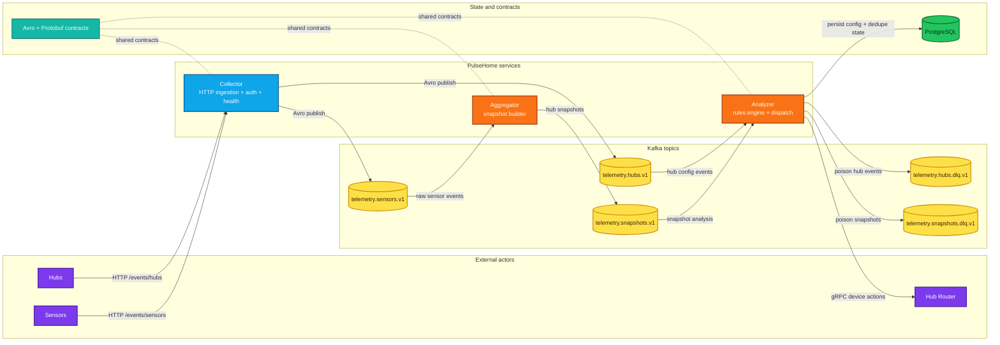

# PulseHome

[Read this in Russian](./README.ru.md)

PulseHome is an open-source Smart Home telemetry platform built as a production-style Java 25 event pipeline. It receives device and hub events over HTTP, streams them through Kafka using Avro contracts, builds hub-level snapshots, evaluates automation scenarios, and dispatches device actions over gRPC.

The repository is designed as a professional reference implementation for resilient backend design around Spring Boot, Kafka, Avro, PostgreSQL, Flyway, and gRPC.

## What PulseHome does

- ingests raw sensor and hub events;
- keeps the latest state of every hub in snapshot form;
- persists hub configuration and automation scenarios;
- evaluates scenarios against incoming snapshots;
- sends device commands back through a hub router;
- stays aligned with a Java 25 runtime baseline for both local development and Docker deployment.

## Architecture at a glance



## Processing flow

1. Devices and hubs send JSON payloads to the Collector.
2. Collector validates, serializes, and publishes events into Kafka.
3. Aggregator consumes sensor events and builds the latest hub snapshot.
4. Analyzer consumes snapshots and hub configuration events, keeps durable state in PostgreSQL, evaluates scenarios, and dispatches actions through the Hub Router.
5. Poison messages are isolated into dedicated DLQ topics instead of stopping the whole pipeline.

## Repository structure

| Module | Purpose |
| --- | --- |
| `telemetry/collector` | Spring Boot web service for HTTP ingestion, security, async Kafka publishing, and actuator health |
| `telemetry/aggregator` | Spring Boot worker that rebuilds current hub state and publishes snapshots |
| `telemetry/analyzer` | Spring Boot worker that stores hub config, evaluates scenarios, and dispatches actions |
| `telemetry/serialization/avro-schemas` | Shared Avro contracts, serializer/deserializer helpers, generated classes |
| `telemetry/serialization/proto-schemas` | Shared protobuf and gRPC contracts |
| `infra/hub-router-stub` | Local gRPC stub for end-to-end smoke testing |

## Service responsibilities

### Collector

- exposes `POST /events/sensors`
- exposes `POST /events/hubs`
- protects ingestion endpoints with Basic Auth
- publishes to `telemetry.sensors.v1` and `telemetry.hubs.v1`
- exposes `GET /actuator/health`

### Aggregator

- consumes `telemetry.sensors.v1`
- restores the last known snapshot state before replay
- keeps hub snapshots in memory with guarded lifecycle/shutdown logic
- publishes updated snapshots to `telemetry.snapshots.v1`

### Analyzer

- consumes `telemetry.hubs.v1`
- consumes `telemetry.snapshots.v1`
- persists sensors, scenarios, conditions, actions, and dispatch history in PostgreSQL
- retries transient action dispatch failures
- sends poisoned hub and snapshot messages to DLQ topics
- dispatches actions through the Hub Router gRPC client

## Event contracts and topic map

| Topic | Producer | Consumer | Payload |
| --- | --- | --- | --- |
| `telemetry.sensors.v1` | Collector | Aggregator | `SensorEventAvro` |
| `telemetry.hubs.v1` | Collector | Analyzer | `HubEventAvro` |
| `telemetry.snapshots.v1` | Aggregator | Analyzer | `SensorsSnapshotAvro` |
| `telemetry.hubs.dlq.v1` | Analyzer | Ops / debugging | JSON dead-letter envelope |
| `telemetry.snapshots.dlq.v1` | Analyzer | Ops / debugging | JSON dead-letter envelope |

## Contract and validation policy

- Avro unions intentionally do not include a `null` branch for event payloads and snapshot sensor data.
  This is a deliberate contract strategy: unsupported payload types must fail fast instead of degrading silently.
- New Avro payloads are appended to existing unions and released together with reader support.
- Sensor DTO validation currently enforces structural correctness, required fields, and string sizes.
- Product-specific physical bounds for values such as temperature, luminosity, link quality, voltage, or CO2 should be added only after the supported device fleet and calibration ranges are formally approved.
- The implementation points for those future bounds are the Collector DTO validation layer and the shared Avro schema docs in `telemetry/collector/src/main/java/.../dto/sensor` and `telemetry/serialization/avro-schemas/src/main/avro`.

## Database migration policy

- Flyway versioned migrations are treated as immutable production history.
- If a historical migration later becomes redundant for fresh installs, it is still preserved as part of the upgrade path for already deployed environments.
- Redundant or defensive migrations are cleaned up only during an explicit baseline reset or a future major migration consolidation, never by editing an applied versioned file in place.
- This is why historical steps such as the existing `V8` index migration remain in the chain: the project prefers auditability and checksum stability over rewriting database history.

## Technology stack

- Java 25
- Maven 3.9+
- Spring Boot 3.5
- Apache Kafka
- Apache Avro
- gRPC / Protobuf
- PostgreSQL
- Flyway
- Bouncy Castle (PQC)
- H2 for tests
- Docker Compose for local production-like runs

## Post-Quantum Cryptography

PulseHome implements hybrid post-quantum protection at the Kafka transport layer, guarding all telemetry traffic against "Store Now, Decrypt Later" (SNDL) attacks.

### Why it matters

Quantum computers capable of breaking RSA and ECC are projected by 2029-2035. Smart home devices have a lifespan of 10-20 years, meaning data captured today may be decrypted retroactively. PulseHome addresses this threat proactively.

### What is protected

```
Collector  ──TLS 1.3 + X25519MLKEM768──>  Kafka
Aggregator ──TLS 1.3 + X25519MLKEM768──>  Kafka
Analyzer   ──TLS 1.3 + X25519MLKEM768──>  Kafka
```

Every Kafka producer and consumer uses a custom `HybridPqcSslEngineFactory` that configures the TLS 1.3 handshake to prioritize the hybrid key exchange group **X25519MLKEM768**.

### Algorithm stack

| Layer | Algorithm | Standard | Purpose |
| --- | --- | --- | --- |
| Key exchange | **X25519MLKEM768** | NIST FIPS 203 + RFC 7748 | Hybrid: classical ECDH (X25519) combined with post-quantum ML-KEM-768 |
| Symmetric cipher | AES-256-GCM or AES-128-GCM / CHACHA20-POLY1305 (TLS 1.3 negotiated) | NIST FIPS 197 | Bulk data encryption after key agreement; actual suite is negotiated by TLS 1.3 with the broker |
| TLS protocol | TLS 1.3 | RFC 8446 | Transport security with forward secrecy |
| JCA provider | Bouncy Castle + BCJSSE | BC 1.81 | PQC-capable JSSE provider for named group negotiation |

### How it works

1. **BCJSSE provider** is registered at application startup in every service.
2. The custom `HybridPqcSslEngineFactory` builds an `SSLContext` from Kafka keystore/truststore config and sets `X25519MLKEM768` as the preferred named group.
3. During the TLS 1.3 handshake, the client proposes both a classical X25519 key share and an ML-KEM-768 encapsulation. The shared secret is derived from **both** algorithms.
4. If the broker or the JVM does not support the hybrid group, the handshake gracefully falls back to classical `secp256r1` ECDH.

### Graceful degradation

The PQC layer is designed to be zero-disruption:

- **Default protocol is `PLAINTEXT`** -- no TLS overhead in dev mode.
- Set `KAFKA_SECURITY_PROTOCOL=SSL` plus keystore/truststore env vars to activate.
- If `X25519MLKEM768` is not available (older JVM, non-PQC broker), the engine silently falls back to standard ECDH groups.
- No application code changes are required -- protection is transparent at the transport level.

### NIST standards coverage

| Standard | Algorithm | Status | Usage in PulseHome |
| --- | --- | --- | --- |
| FIPS 203 | ML-KEM (CRYSTALS-Kyber) | Finalized Aug 2024 | Key exchange via X25519MLKEM768 |
| FIPS 204 | ML-DSA (CRYSTALS-Dilithium) | Finalized Aug 2024 | Available via Bouncy Castle for future certificate signing |
| FIPS 205 | SLH-DSA (SPHINCS+) | Finalized Aug 2024 | Available as conservative backup |

### Configuration

```bash
# Enable PQC-protected Kafka connections
KAFKA_SECURITY_PROTOCOL=SSL
KAFKA_SSL_TRUSTSTORE_LOCATION=/path/to/client.truststore.jks
KAFKA_SSL_TRUSTSTORE_PASSWORD=changeit
KAFKA_SSL_KEYSTORE_LOCATION=/path/to/client.keystore.jks
KAFKA_SSL_KEYSTORE_PASSWORD=changeit
KAFKA_SSL_KEY_PASSWORD=changeit
```

## Java 25 baseline

PulseHome is intentionally aligned to Java 25.

What is already tuned for it:

- Docker runtime uses Java 25 and enables the native-access flags needed by modern gRPC/Netty stacks.
- Local Maven runs use [.mvn/jvm.config](./.mvn/jvm.config) to suppress Java 25 `sun.misc.Unsafe` noise coming from Maven internals.
- Surefire disables CDS sharing for test JVMs to avoid noisy Java 25 bootstrap warnings.
- Docker and local Maven builds are kept warning-clean for the current toolchain baseline.

## Quick start with Docker

This is the fastest way to run the whole stack locally.

```bash
cp .env.example .env
# edit .env with your local secrets
docker compose up --build -d
```

What starts:

- Kafka
- PostgreSQL
- Collector
- Aggregator
- Analyzer
- Hub Router Stub

Quick checks:

```bash
curl http://localhost:8080/actuator/health
docker compose ps
docker compose logs -f collector
```

`docker compose` reads secrets from environment variables or a local `.env` file.
Tracked files only ship the [.env.example](./.env.example) template.

To stop the stack:

```bash
docker compose down
```

## Local development without Docker

Prerequisites:

- JDK 25
- Maven 3.9+
- Kafka reachable by configured bootstrap servers
- PostgreSQL for Analyzer runtime
- a Hub Router gRPC endpoint, or the local stub from `infra/hub-router-stub`

Recommended startup order:

1. Kafka
2. PostgreSQL
3. Hub Router Stub
4. Collector
5. Aggregator
6. Analyzer

Run services from the repository root:

```bash
mvn -pl infra/hub-router-stub spring-boot:run
mvn -pl telemetry/collector spring-boot:run
mvn -pl telemetry/aggregator spring-boot:run
mvn -pl telemetry/analyzer spring-boot:run
```

## Configuration

The services use Spring profiles and environment variables. `dev` is aimed at local work, and `prod` is used by Docker Compose.

Most important variables:

```bash
SPRING_PROFILES_ACTIVE=dev
KAFKA_BOOTSTRAP_SERVERS=localhost:9092
ANALYZER_DATASOURCE_URL=jdbc:postgresql://localhost:5432/analyzer
ANALYZER_DATASOURCE_USERNAME=your-db-user
ANALYZER_DATASOURCE_PASSWORD=your-db-password
GRPC_HUB_ROUTER_ADDRESS=static://localhost:59090
GRPC_HUB_ROUTER_NEGOTIATION_TYPE=plaintext
COLLECTOR_BASIC_AUTH_USERNAME=collector
COLLECTOR_BASIC_AUTH_PASSWORD=your-collector-password
```

## Build and test

Run the full test suite:

```bash
mvn test -DskipITs
```

Run a single module:

```bash
mvn -pl telemetry/collector test -DskipITs
mvn -pl telemetry/aggregator test -DskipITs
mvn -pl telemetry/analyzer test -DskipITs
```

Build the full repository:

```bash
mvn clean verify -DskipITs
```

## Engineering focus

PulseHome is built as a production-minded engineering project. The main priorities are:

- explicit schema contracts;
- stable Java 25 runtime behavior;
- resilient Kafka workers with graceful shutdown;
- safe retry and DLQ handling;
- repeatable local production-like runs with Docker Compose;
- clear service boundaries and testable code.

## License

This project is licensed under the [MIT License](./LICENSE).
