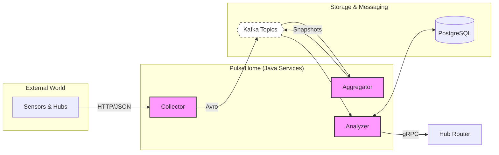

# PulseHome

[Read this in English](./README.md)

PulseHome — это open-source платформа для обработки телеметрии умного дома, построенная как набор Java-сервисов вокруг Kafka, Avro, Spring Boot и gRPC.

Проект моделирует реалистичный backend-конвейер для Smart Home систем:

- устройства и хабы отправляют события в платформу;
- платформа агрегирует сырые потоки датчиков в снапшоты состояния хаба;
- анализатор проверяет пользовательские сценарии и отправляет команды устройствам через hub router.

Репозиторий задуман не только как учебный проект, но и как аккуратный публичный пример event-driven backend-архитектуры на Java.

## Зачем нужен проект

PulseHome создавался, чтобы отработать ключевые задачи backend-разработки для умного дома:

- приём разнородных событий от устройств и хаба;
- поддержание актуального состояния дома;
- безопасная проверка пользовательских сценариев;
- работа с ретраями, дедупликацией и корректным shutdown в Kafka worker-сервисах;
- разделение слоёв транспорта, доменной логики и хранения данных.

## Архитектура



## Реализованные модули

Корневой проект — это multi-module Maven build.

### `telemetry`

Это основная реализованная часть репозитория.

- `telemetry/collector`
  Принимает входящие события и публикует их в Kafka.
- `telemetry/aggregator`
  Читает сырые события датчиков, собирает актуальный снапшот по хабу и публикует обновления.
- `telemetry/analyzer`
  Хранит конфигурацию хаба и сценарии, анализирует снапшоты и отправляет действия через gRPC.
- `telemetry/serialization`
  Содержит общие Avro-схемы, сгенерированные контракты и protobuf/gRPC-описания.

### `infra` и `commerce`

Эти модули присутствуют в сборке как точки расширения на будущее, но текущая рабочая реализация сосредоточена на telemetry pipeline.

## Роли сервисов

### Collector

Collector — это Spring Boot web-приложение, которое принимает входящие события и отправляет их в Kafka.

Текущие endpoints:

- `POST /events/sensors`
- `POST /events/hubs`

Kafka topics:

- `telemetry.sensors.v1`
- `telemetry.hubs.v1`

### Aggregator

Aggregator — это non-web Spring Boot worker.

Он:

- читает `telemetry.sensors.v1`;
- поддерживает последнее состояние датчиков для каждого хаба;
- публикует обновлённые снапшоты в `telemetry.snapshots.v1`;
- не пишет новый снапшот, если состояние фактически не изменилось.

### Analyzer

Analyzer — это non-web Spring Boot worker с двумя независимыми Kafka polling loop.

Он:

- читает события конфигурации хаба из `telemetry.hubs.v1`;
- читает снапшоты из `telemetry.snapshots.v1`;
- сохраняет датчики, сценарии, условия и действия в PostgreSQL;
- проверяет сценарии по состоянию хаба;
- отправляет команды через Hub Router gRPC client;
- отслеживает уже отправленные действия, чтобы не повторять небезопасные dispatch при retryable-сбоях.

## Технологический стек

- Java 25
- Maven
- Spring Boot 3.5
- Apache Kafka
- Apache Avro
- gRPC / Protobuf
- PostgreSQL
- Flyway
- H2 для тестов

## Что нужно для локального запуска

Перед запуском сервисов локально убедитесь, что у вас есть:

- JDK 25
- Maven 3.9+
- Kafka, запущенная локально или доступная по настроенному bootstrap server
- PostgreSQL для runtime-базы Analyzer
- gRPC endpoint Hub Router, если вы хотите проверить реальную отправку действий из Analyzer

## Конфигурация

Сервисы настраиваются через Spring Boot `application.yml` и переменные окружения.

Основные значения по умолчанию:

- Kafka bootstrap servers: `localhost:9092`
- Analyzer PostgreSQL URL: `jdbc:postgresql://localhost:5432/analyzer`
- Analyzer Hub Router gRPC address: `localhost:59090`

Полезные переменные окружения:

```bash
KAFKA_BOOTSTRAP_SERVERS=localhost:9092
ANALYZER_DATASOURCE_URL=jdbc:postgresql://localhost:5432/analyzer
ANALYZER_DATASOURCE_USERNAME=postgres
ANALYZER_DATASOURCE_PASSWORD=postgres
```

## Сборка и тесты

Полный прогон тестов:

```bash
mvn test
```

Тесты конкретного модуля:

```bash
mvn -pl telemetry/collector test
mvn -pl telemetry/aggregator test
mvn -pl telemetry/analyzer test
```

Полная сборка проекта:

```bash
mvn clean verify
```

## Локальный запуск сервисов

Рекомендуемый порядок запуска:

1. Kafka
2. PostgreSQL
3. Collector
4. Aggregator
5. Analyzer

Команды из корня репозитория:

```bash
mvn -pl telemetry/collector spring-boot:run
mvn -pl telemetry/aggregator spring-boot:run
mvn -pl telemetry/analyzer spring-boot:run
```

## Заметки для разработки

- Collector сейчас использует HTTP endpoints для ingestion.
- Aggregator и Analyzer — это worker-процессы без web UI.
- Analyzer работает с PostgreSQL в runtime и с H2 в тестах.
- Общие wire-контракты вынесены в serialization-модули, чтобы сервисы жили вокруг единой модели событий.

## Цели качества

Этот репозиторий специально стремится быть выше уровня “минимально сдать задание”.

Ключевые инженерные цели:

- ясные границы между сервисами;
- явные schema contracts;
- безопасная работа со смещениями Kafka;
- retry-aware обработка;
- идемпотентное отслеживание уже отправленных действий;
- production-style конфигурация и валидация;
- поддерживаемый и тестируемый код.

## Идеи для развития

Что можно добавить дальше:

- containerized локальную инфраструктуру для запуска одной командой;
- end-to-end интеграционные тесты с Kafka и PostgreSQL;
- observability и метрики;
- reference-реализацию Hub Router;
- более богатые типы сценариев и возможностей устройств.

## Лицензия

Проект распространяется по лицензии [MIT](./LICENSE).
