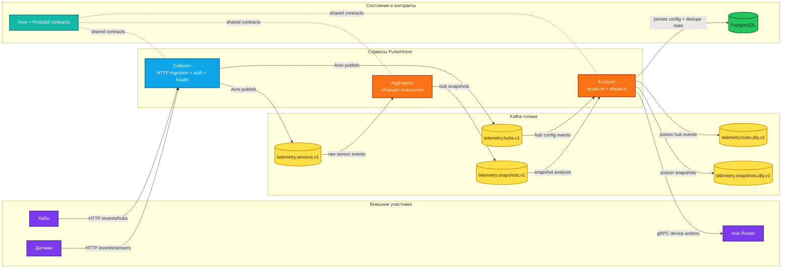

# PulseHome

[Read this in English](./README.md)

PulseHome — это open-source платформа телеметрии умного дома, собранная как production-style конвейер на Java 25. Она принимает события устройств и хабов по HTTP, передаёт их через Kafka в Avro-формате, строит снапшоты состояния хаба, проверяет сценарии автоматизации и отправляет команды устройствам по gRPC.

Репозиторий задуман как полноценный инженерный образец event-driven backend-архитектуры на Spring Boot, Kafka, Avro, PostgreSQL, Flyway и gRPC.

## Что делает PulseHome

- принимает сырые sensor и hub события;
- поддерживает актуальное состояние каждого хаба в виде снапшота;
- хранит конфигурацию хаба и пользовательские сценарии;
- проверяет сценарии по входящим снапшотам;
- отправляет команды обратно через Hub Router;
- остаётся выровненным под Java 25 и для локальной разработки, и для Docker runtime.

## Архитектура на одном экране



## Поток обработки

1. Устройства и хабы отправляют JSON payload в Collector.
2. Collector валидирует данные, сериализует их и публикует в Kafka.
3. Aggregator читает sensor events и строит актуальный снапшот хаба.
4. Analyzer читает снапшоты и hub-конфигурацию, хранит состояние в PostgreSQL, проверяет сценарии и отправляет действия через Hub Router.
5. Problematic messages не валят весь pipeline, а уходят в отдельные DLQ-топики.

## Структура репозитория

| Модуль | Назначение |
| --- | --- |
| `telemetry/collector` | Spring Boot web-сервис для HTTP ingestion, security, async Kafka publishing и actuator health |
| `telemetry/aggregator` | Spring Boot worker, который пересобирает актуальное состояние хаба и публикует снапшоты |
| `telemetry/analyzer` | Spring Boot worker, который хранит конфигурацию, проверяет сценарии и отправляет действия |
| `telemetry/serialization/avro-schemas` | Общие Avro-контракты, serializer/deserializer helper’ы, generated classes |
| `telemetry/serialization/proto-schemas` | Общие protobuf и gRPC-контракты |
| `infra/hub-router-stub` | Локальный gRPC stub для end-to-end smoke testing |

## Роли сервисов

### Collector

- предоставляет `POST /events/sensors`
- предоставляет `POST /events/hubs`
- защищает ingestion endpoints через Basic Auth
- публикует в `telemetry.sensors.v1` и `telemetry.hubs.v1`
- отдаёт `GET /actuator/health`

### Aggregator

- читает `telemetry.sensors.v1`
- восстанавливает последнее известное snapshot-state перед replay
- хранит hub snapshots в памяти с защищённым lifecycle/shutdown
- публикует обновлённые снапшоты в `telemetry.snapshots.v1`

### Analyzer

- читает `telemetry.hubs.v1`
- читает `telemetry.snapshots.v1`
- сохраняет датчики, сценарии, условия, действия и историю dispatch в PostgreSQL
- ретраит transient action-dispatch ошибки
- отправляет poisoned hub/snapshot сообщения в DLQ
- dispatch’ит действия через Hub Router gRPC client

## Контракты и карта топиков

| Топик | Producer | Consumer | Payload |
| --- | --- | --- | --- |
| `telemetry.sensors.v1` | Collector | Aggregator | `SensorEventAvro` |
| `telemetry.hubs.v1` | Collector | Analyzer | `HubEventAvro` |
| `telemetry.snapshots.v1` | Aggregator | Analyzer | `SensorsSnapshotAvro` |
| `telemetry.hubs.dlq.v1` | Analyzer | Ops / debugging | JSON dead-letter envelope |
| `telemetry.snapshots.dlq.v1` | Analyzer | Ops / debugging | JSON dead-letter envelope |

## Политика контрактов и валидации

- Avro unions для event payloads и snapshot sensor data намеренно не содержат `null`-ветку.
  Это осознанная контрактная стратегия: неподдерживаемый payload должен падать явно, а не деградировать молча.
- Новые Avro payload-типы добавляются только append-only в существующие unions и выкатываются вместе с поддержкой reader’ов.
- Валидация sensor DTO сейчас проверяет структурную корректность, обязательные поля и размеры строк.
- Product-specific физические диапазоны для значений вроде temperature, luminosity, link quality, voltage или CO2 нужно добавлять только после отдельного продуктового решения по поддерживаемому sensor fleet и правилам калибровки.
- Основные точки, куда это потом вносить для production-решения: слой DTO-валидации в `telemetry/collector/src/main/java/.../dto/sensor` и документация shared Avro-схем в `telemetry/serialization/avro-schemas/src/main/avro`.

## Политика миграций базы данных

- Версионированные Flyway-миграции считаются неизменяемой production-историей.
- Если историческая миграция со временем становится избыточной для свежих инсталляций, она всё равно сохраняется как часть корректного upgrade path для уже развернутых сред.
- Избыточные или defensive-миграции убираются только при отдельном baseline reset или в рамках будущей крупной консолидации миграций, но не через редактирование уже применённого versioned-файла.
- Именно поэтому исторические шаги вроде существующей `V8` migration остаются в цепочке: проект предпочитает auditability и стабильность checksum’ов переписыванию истории базы.

## Технологический стек

- Java 25
- Maven 3.9+
- Spring Boot 3.5
- Apache Kafka
- Apache Avro
- gRPC / Protobuf
- PostgreSQL
- Flyway
- H2 для тестов
- Docker Compose для локального production-like запуска

## Java 25 baseline

PulseHome осознанно закреплён на Java 25.

Что уже настроено под неё:

- Docker runtime работает на Java 25 и включает native-access флаги, нужные для современных gRPC/Netty стеков.
- Локальный Maven использует [.mvn/jvm.config](./.mvn/jvm.config), чтобы убрать Java 25 `sun.misc.Unsafe` noise от внутренних Maven-зависимостей.
- Surefire отключает CDS sharing для test JVM, чтобы не было лишних bootstrap warning’ов на Java 25.
- Docker и локальные Maven-сборки очищены от warning’ов текущего toolchain baseline.

## Быстрый старт через Docker

Это самый быстрый способ поднять весь стек локально.

```bash
cp .env.example .env
# заполните .env своими локальными секретами
docker compose up --build -d
```

Что стартует:

- Kafka
- PostgreSQL
- Collector
- Aggregator
- Analyzer
- Hub Router Stub

Быстрые проверки:

```bash
curl http://localhost:8080/actuator/health
docker compose ps
docker compose logs -f collector
```

`docker compose` читает секреты из переменных окружения или локального файла `.env`.
В репозитории хранится только шаблон [.env.example](./.env.example).

Остановить стек:

```bash
docker compose down
```

## Локальная разработка без Docker

Что нужно:

- JDK 25
- Maven 3.9+
- Kafka, доступная по настроенным bootstrap servers
- PostgreSQL для runtime Analyzer
- gRPC endpoint Hub Router или локальный stub из `infra/hub-router-stub`

Рекомендуемый порядок запуска:

1. Kafka
2. PostgreSQL
3. Hub Router Stub
4. Collector
5. Aggregator
6. Analyzer

Команды из корня репозитория:

```bash
mvn -pl infra/hub-router-stub spring-boot:run
mvn -pl telemetry/collector spring-boot:run
mvn -pl telemetry/aggregator spring-boot:run
mvn -pl telemetry/analyzer spring-boot:run
```

## Конфигурация

Сервисы используют Spring profiles и переменные окружения. `dev` предназначен для локальной разработки, `prod` используется Docker Compose.

Основные переменные:

```bash
SPRING_PROFILES_ACTIVE=dev
KAFKA_BOOTSTRAP_SERVERS=localhost:9092
ANALYZER_DATASOURCE_URL=jdbc:postgresql://localhost:5432/analyzer
ANALYZER_DATASOURCE_USERNAME=ваш-пользователь-бд
ANALYZER_DATASOURCE_PASSWORD=ваш-пароль-бд
GRPC_HUB_ROUTER_ADDRESS=static://localhost:59090
GRPC_HUB_ROUTER_NEGOTIATION_TYPE=plaintext
COLLECTOR_BASIC_AUTH_USERNAME=collector
COLLECTOR_BASIC_AUTH_PASSWORD=ваш-пароль-collector
```

## Сборка и тесты

Полный прогон тестов:

```bash
mvn test -DskipITs
```

Прогон одного модуля:

```bash
mvn -pl telemetry/collector test -DskipITs
mvn -pl telemetry/aggregator test -DskipITs
mvn -pl telemetry/analyzer test -DskipITs
```

Полная сборка репозитория:

```bash
mvn clean verify -DskipITs
```

## Инженерный фокус проекта

PulseHome сделан как production-minded инженерный проект. Основные приоритеты:

- явные schema contracts;
- стабильное поведение на Java 25;
- устойчивые Kafka worker’ы с корректным shutdown;
- безопасные retry и DLQ path;
- повторяемый локальный production-like запуск через Docker Compose;
- ясные границы сервисов и тестируемый код.

## Лицензия

Проект распространяется по лицензии [MIT](./LICENSE).
